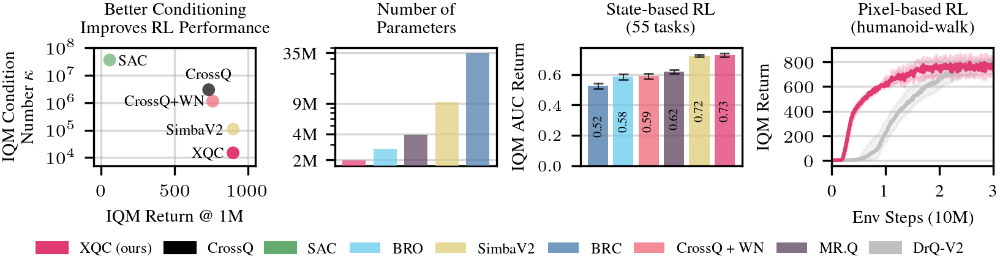

<h1></h1>

Official implementation of 

**XQC: Well-conditioned Optimization Accelerates Deep Reinforcement Learning**\
[Daniel Palenicek](https://danielpalenicek.github.io/), 
[Florian Vogt](https://fvgt.github.io/), 
[Joe Watson](https://joemwatson.github.io/), 
[Ingmar Posner](https://eng.ox.ac.uk/people/ingmar-posner) and 
[Jan Peters](https://www.ias.informatik.tu-darmstadt.de/Team/JanPeters)\
International Conference on Learning Representations (ICLR) 2026\
[[Paper]](https://arxiv.org/abs/2509.25174) [[Website]](https://danielpalenicek.github.io/projects/xqc)

> **TL;DR:** We introduce XQC; A well-conditioned critic architecture that achieves state-of-the-art sample efficiency on 70 continuous control tasks with 4.5× fewer parameters than SimbaV2.



## Abstract
Sample efficiency is a central property of effective deep reinforcement learning algorithms. Recent work has improved this through added complexity, such as larger models, exotic network architectures, and more complex algorithms, which are typically motivated purely by empirical performance. We take a more principled approach by focusing on the optimization landscape of the critic network. Using the eigenspectrum and condition number of the critic's Hessian, we systematically investigate the impact of common architectural design decisions on training dynamics. Our analysis reveals that a novel combination of batch normalization (BN), weight normalization (WN), and a distributional cross-entropy (CE) loss produces condition numbers orders of magnitude smaller than baselines. This combination also naturally bounds gradient norms, a property critical for maintaining a stable effective learning rate under non-stationary targets and bootstrapping. Based on these insights, we introduce XQC: a well-motivated, sample-efficient deep actor-critic algorithm built upon soft actor-critic that embodies these optimization-aware principles. We achieve state-of-the-art sample efficiency across 55 proprioception and 15 vision-based continuous control tasks, all while using significantly fewer parameters than competing methods.

## Setup

### 1. Clone the Repository recursively to include the necessary submodules
```bash
git clone --recurse-submodules https://github.com/danielpalenicek/xqc.git
cd xqc
```

### 2. Environment Setup

Using `uv` to sync the dependencies:
```bash
uv sync
# To run commands:
uv run python train_parallel.py ...
```


# Usage

The main entry point for training is `train_parallel.py`.

#### Basic Example
Train XQC on the `h1-walk-v0` environment:
```bash
uv run python train_parallel.py env=h1-walk-v0 seed=1
```

#### Key Arguments
| Argument | Default | Description |
|----------|---------|-------------|
| `env` | `h1-walk-v0` | Name of the environment to train on from available Benchmark suites (`dmc`, `mujoco`, `myo`, `hb`). |
| `seed` | `0` | Random seed for reproducibility. |
| `max_steps` | `1_000_000` | Total training steps. |
| `num_seeds` | `10` | Number of parallel seeds to run simultaneously (JAX vmap). |
| `wandb.mode` | `disabled` | Set to `online` to log results to Weights & Biases. |

## Reproducing Baselines and Ablations

XQC adds three components on top of SAC: batch normalization (BN), weight normalization (WN), and a distributional cross-entropy (CE) loss. Each is independently toggleable via config flags, so you can reproduce the paper's baselines or recover plain SAC without modifying any code.

### Built-in baselines

```bash
# XQC (BN + WN + CE loss)
uv run python train_parallel.py agent=xqc env=<env> seed=0

# CrossQ (BN post-activation, MSE loss, no WN)
uv run python train_parallel.py agent=crossq env=<env> seed=0

# CrossQ + Weight Normalization
uv run python train_parallel.py agent=crossq_wn env=<env> seed=0
```

### Ablating individual XQC components

| Component | Flag | XQC default | Disabled value |
|---|---|---|---|
| Batch normalization | `agent.use_batch_norm` | `1` | `0` |
| BN placement (pre vs post activation) | `agent.pre_activation_bn` | `1` | `0` |
| Weight normalization | `agent.use_weight_norm` | `1` | `0` |
| Distributional CE loss | `agent.critic_loss` | `categorical` | `mse` |
| Reward normalization | `agent.reward_normalization` | `true` | `false` |

Example — disable only the CE loss, keep BN and WN:
```bash
uv run python train_parallel.py agent=xqc agent.critic_loss=mse env=<env> seed=0
```

### Recovering SAC

Set all three XQC components to off, plus a few additional flags that differ from standard SAC defaults:

```bash
uv run python train_parallel.py \
  agent=xqc \
  agent.use_batch_norm=0 \
  agent.use_weight_norm=0 \
  agent.critic_loss=mse \
  agent.reward_normalization=false \
  agent.policy_delay=1 \
  agent.lr_end=3e-4 \
  agent.hidden_dims_critic=[256,256] \
  agent.hidden_dims_actor=[256,256] \
  env=<env> seed=0
```

| Extra flag | Reason |
|---|---|
| `agent.policy_delay=1` | XQC default is 3 (delayed actor updates); SAC updates every step |
| `agent.lr_end=3e-4` | Matches `actor_lr` to flatten the built-in linear LR decay schedule |
| `agent.hidden_dims_*=[256,256]` | XQC default is 4 layers × 512/256; canonical SAC uses 2 layers × 256 |

## Online Condition-Number (κ) Logging

XQC's thesis is that a well-conditioned critic (low κ = |λ_max| / |λ_min| of the loss Hessian) drives sample efficiency. The codebase includes a lightweight online estimator that logs κ, λ_max, and λ_min to wandb every K environment steps using power iteration (2–3 HVPs per step, one fixed minibatch). This is separate from the expensive offline Lanczos analysis (`log_interval_condition_number`) and adds negligible overhead.

κ logging is off by default so existing configs are unaffected. Enable it with `kappa_logging.enabled=true`.

### Config flags

| Flag | Default | Description |
|---|---|---|
| `kappa_logging.enabled` | `false` | Enable online κ logging |
| `kappa_logging.interval` | `1000` | Log κ every this many env steps |
| `kappa_logging.n_iters_max` | `3` | Power-iteration steps for λ_max |
| `kappa_logging.n_iters_min` | `5` | Spectral-shift steps for λ_min (the finicky one) |

### Wandb metrics

Each seed logs three series: `seed{i}/kappa/kappa`, `seed{i}/kappa/lambda_max`, `seed{i}/kappa/lambda_min`. Plot on log-scale y-axes.

### Test 1 — verify logging doesn't affect training

Run the same seed twice and confirm the reward traces are identical. κ computation is purely functional (JAX `jvp`/`grad`, no agent state mutation), so they must match exactly.

```bash
# Reference run (logging off)
uv run python train_parallel.py \
  env=dog-trot seed=0 max_steps=10000 num_seeds=1 \
  kappa_logging.enabled=false

# Logging-on run
uv run python train_parallel.py \
  env=dog-trot seed=0 max_steps=10000 num_seeds=1 \
  kappa_logging.enabled=true kappa_logging.interval=1000
```

Compare `seed0/r` in wandb (or stdout) — the two runs must be numerically identical. Any divergence means something is leaking into the gradient path and the κ numbers cannot be trusted.

### Test 2 — validate the κ contrast (XQC vs SAC)

The canonical validation is `dog-trot` from DMC. Expected result: XQC produces low, stable κ; the SAC ablation produces high, volatile κ — reproducing the paper's offline finding with the cheaper online estimator.

```bash
# XQC — expect low, stable κ
uv run python train_parallel.py \
  agent=xqc env=dog-trot seed=0 num_seeds=1 \
  kappa_logging.enabled=true kappa_logging.interval=1000 \
  wandb.mode=online

# SAC ablation — expect high, volatile κ
uv run python train_parallel.py \
  agent=xqc env=dog-trot seed=0 num_seeds=1 \
  agent.use_batch_norm=0 \
  agent.use_weight_norm=0 \
  agent.critic_loss=mse \
  agent.reward_normalization=false \
  agent.policy_delay=1 \
  agent.lr_end=3e-4 \
  agent.hidden_dims_critic=[256,256] \
  agent.hidden_dims_actor=[256,256] \
  kappa_logging.enabled=true kappa_logging.interval=1000 \
  wandb.mode=online
```

Use `num_seeds=1` for a quick first pass; increase to `num_seeds=10` for the final figure (κ is computed independently per seed).

### Running component ablations with κ logging

You can log κ for any intermediate ablation by combining flags:

```bash
# XQC minus CE loss only (keep BN + WN, switch to MSE)
uv run python train_parallel.py \
  agent=xqc env=dog-trot seed=0 \
  agent.critic_loss=mse \
  kappa_logging.enabled=true kappa_logging.interval=1000 \
  wandb.mode=online

# XQC minus WN only
uv run python train_parallel.py \
  agent=xqc env=dog-trot seed=0 \
  agent.use_weight_norm=0 \
  kappa_logging.enabled=true kappa_logging.interval=1000 \
  wandb.mode=online

# XQC minus BN only
uv run python train_parallel.py \
  agent=xqc env=dog-trot seed=0 \
  agent.use_batch_norm=0 \
  kappa_logging.enabled=true kappa_logging.interval=1000 \
  wandb.mode=online
```

## Acknowledgments
This codebase builds upon and adapts code from several open-source repositories. We thank the authors for their contributions:
- [jaxrl](https://github.com/ikostrikov/jaxrl) which served as the original foundation for this codebase.
- [SimbaV2](https://github.com/dojeon-ai/SimbaV2) for metrics computation tools.
- [BiggerRegularizedCategorical](https://github.com/naumix/BiggerRegularizedCategorical) for parallel environment wrappers.
- [deep-rl-plasticity](https://github.com/awjuliani/deep-rl-plasticity) for network dormancy and plasticity metric tracking.
- [spectral-density](https://github.com/google/spectral-density) for our Hessian eigenspectrum analyses.

## License
This project is licensed under the MIT License - see the [LICENSE](LICENSE) file for details.

## Citation
If you find this code useful for your research, please cite our paper:

```bibtex
@inproceedings{palenicek2026xqc,
  title={XQC: Well-Conditioned Optimization Accelerates Deep Reinforcement Learning},
  author={Palenicek, Daniel and Vogt, Florian and Watson, Joe and Posner, Ingmar and Peters, Jan},
  booktitle={International Conference on Learning Representations (ICLR)},
  year={2026}
}
```
